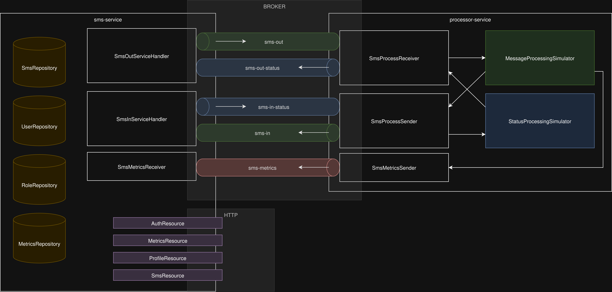
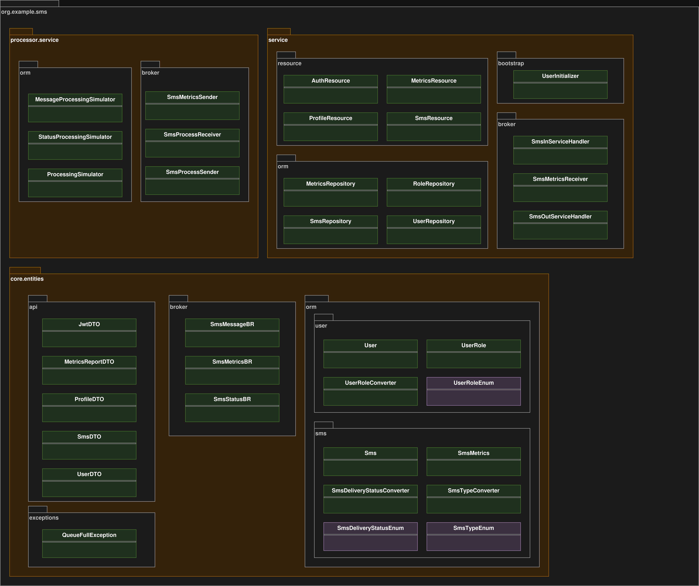

# SMS Service API

This project provides a RESTful API for SMS service management. It supports the following core functionalities:

- **User authentication**
- **SMS message management** (send, retrieve)
- **User profile access**
- **SMS usage metrics**

## API Documentation

A Swagger UI is available to explore and test all available API endpoints once the service has started:

[http://localhost:8080/q/swagger-ui](http://localhost:8080/q/swagger-ui)


---

## Building

### Build jars with dependencies
```bash
mvn clean package -Dquarkus.package.type=uber-jar
```
### Build docker images and start services
```bash
docker-compose -f docker-compose.local.yml up --build
```
### Start services by using prebuilt docker images
```bash
docker-compose -f docker-compose.remote.yml up --build
```

---

## API calls

### POST /auth/login
Authenticate user and return a JWT token.

### GET /metrics
Retrieve aggregated SMS metrics.

### GET /profile
Get user profile extracted from JWT claims.

### GET /sms/listIncoming
List incoming SMS messages for authenticated user.

### GET /sms/listOutgoing
List outgoing SMS messages for authenticated user.

### POST /sms/send
Send an SMS message if authorized and valid.

---

## Architecture



